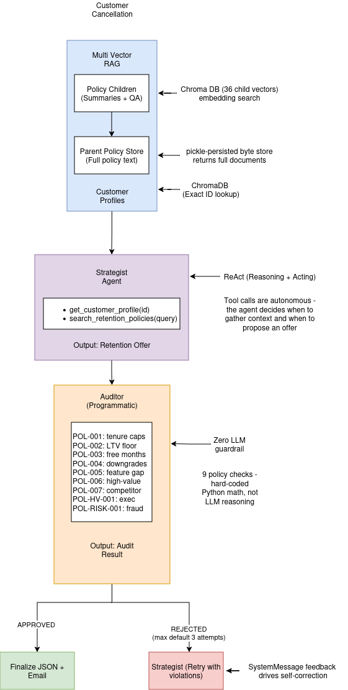

# ACRA - Agentic Customer Churn & Retention Agent

An autonomous multi-agent retention system that intercepts SaaS subscription cancellations using LangGraph-based ReAct agents with true multi-vector RAG over ChromaDB.

## Architecture



## Tech Stack

| Component | Technology |
|-----------|-----------|
| Agent Framework | LangGraph (StateGraph, ToolNode, conditional edges) |
| Agent Pattern | ReAct (Reasoning + Acting) with tool-calling loop |
| RAG Architecture | Multi-Vector RAG (parent-child chunking, ChromaDB + byte store) |
| Policy Enforcement | Programmatic (hard-coded Python, zero LLM for compliance) |
| LLM Orchestration | DeepSeek via LangChain ChatOpenAI-compatible API |
| Structured Output | Pydantic models via JSON extraction from agent messages |
| Vector Database | ChromaDB (persistent, local) |
| Embeddings | Sentence Transformers (all-MiniLM-L6-v2, local CPU) |
| State Management | LangGraph MessagesState with `add_messages` reducer |

## Project Structure

```
acra/
├── src/acra/
│   ├── agent/
│   │   ├── graph.py          # LangGraph workflow (retrieval → strategist ↔ tools → auditor)
│   │   ├── state.py           # RetentionState(MessagesState) with 10 fields
│   │   ├── strategist.py      # ReAct agent with bound tools + structured output
│   │   ├── auditor.py         # Programmatic Auditor (9 hard-coded policy checks)
│   │   └── tools.py           # @tool functions: get_customer_profile, search_retention_policies
│   ├── rag/
│   │   ├── retriever.py       # MultiVectorPolicyRetriever (child match → parent return)
│   │   ├── vector_store.py    # ChromaDB collections + pickle-persisted parent store
│   │   ├── embeddings.py      # Local sentence-transformer + LangChain adapter
│   │   └── chunker.py         # LLM-based policy chunking (summary + 3 hypothetical Qs)
│   ├── data/
│   │   ├── customer_profiles.py  # 5 sample customer profiles
│   │   ├── playbook.py        # 9 company retention policies (POL-001 through POL-RISK-001)
│   │   └── seed.py            # Multi-vector ChromaDB seeding
│   ├── models/
│   │   └── __init__.py        # Pydantic schemas (RetentionOffer, AuditResult, etc.)
│   └── main.py                # CLI entry point (interactive, single, demo modes)
└── tests/
    ├── conftest.py
    ├── test_models.py         # Pydantic validation + bounds
    ├── test_graph.py          # Routing logic + topology
    ├── test_strategist.py     # Node creation + tool binding
    ├── test_auditor.py        # All 9 policy checks + JSON extraction
    ├── test_tools.py          # Tool schemas + invocation
    └── test_rag.py            # Multi-vector retrieval + store persistence
```

## Setup

```bash
# Clone and enter project
cd acra

# Create and activate virtual environment
python -m venv .venv
source .venv/bin/activate

# Install with dependencies
pip install -e .

# Set your DeepSeek API key
cp .env.example .env
# Edit .env with your actual key

# Seed the vector database (generates 36 child vectors from 9 policies)
make seed

# Run interactive mode
make run
```

## Usage

```bash
# Interactive mode (choose from menu)
make run

# Single customer
python -m acra.main --customer CUST-001 --reason "Too expensive"

# Run all 5 demo scenarios
python -m acra.main --demo

# Seed and run demo in one command
python -m acra.main --seed --demo

# Export result as JSON
python -m acra.main --customer CUST-001 --reason "Too expensive" --output result.json
```

## How It Works

### Multi-Vector RAG Retrieval

Each of the 9 company policies is decomposed into 4 child documents (1 factual summary + 3 hypothetical questions) by an LLM. These 36 children are embedded in ChromaDB - each with its own vector. The full parent policy text is stored in a pickle-persisted byte store.

At query time, the user's query is embedded and matched against child vectors. Matching children reveal their parent `policy_id`, and the full parent text is fetched from the byte store with deduplication. This gives the agent rich, complete policy context while keeping retrieval precision high through targeted child embeddings.

### Strategist Agent (ReAct)

The Strategist is a fully autonomous tool-calling agent. It has access to two tools:
- `get_customer_profile(customer_id)` - retrieves the full account profile
- `search_retention_policies(query)` - performs multi-vector RAG search

The agent follows the ReAct (Reasoning + Acting) pattern: it decides *when* to call tools, *which* tools to call, and *when* it has enough context to propose an offer. The LangGraph graph routes between the Strategist and a ToolNode until the agent produces a final response (no more tool calls).

The final response is a JSON `RetentionOffer` with discount percentage, duration, offer type, justification, chain-of-thought reasoning, and a personalized email draft.

### Auditor (Programmatic Guardrail)

The Auditor performs **zero-LLM, hard-coded policy checks**. Each of the 9 policies is enforced by a pure Python function that does exact math:

| Policy | Enforcement |
|--------|------------|
| POL-001 | Tenure-bucket discount caps (`<6mo→20%`, `6-12mo→30%`, `12-24mo→40%`, `24+→50%`) |
| POL-002 | Revenue floor = `max(monthly*0.3, $5.00)` |
| POL-003 | Free months: 12+mo tenure only, max 2, no discount combo |
| POL-004 | Cost concern → prefer downgrade; Enterprise requires scrutiny |
| POL-005 | Feature gap → must include tier trial; accepts compound offers |
| POL-006 | High-value flagging (LTV >$10k or monthly >$500) |
| POL-007 | Competitor: price match below 50% of current rate rejected |
| POL-HV-001 | Executive reach-out trigger at LTV >$25k |
| POL-RISK-001 | Serial canceller awareness |

### Self-Correction Loop

When the Auditor finds violations, it appends a `SystemMessage` with the specific policy violations and the exact numeric limits that were breached. The conditional edge routes back to the Strategist, which reads the feedback and generates a revised offer. This loops up to 3 times (configurable via `MAX_RETENTION_LOOP_ITERATIONS`), after which the best available offer is finalized.

## Company Playbook (9 Policies)

| Policy | Category | Description |
|--------|----------|-------------|
| POL-001 | discount_limit | Tenure-based maximum discount limits (20%-50%) |
| POL-002 | ltv_protection | Lifetime value floor (30% of current rate, $5 minimum) |
| POL-003 | free_months | Free month eligibility (12+mo tenure, max 2, no combo) |
| POL-004 | plan_downgrade | Plan downgrade preference over discounts |
| POL-005 | feature_request | Feature gap handling with tier trials (compound offers accepted) |
| POL-006 | high_value_protocol | High-value customer premium protocols (LTV >$10k) |
| POL-007 | competitor_response | Competitor price match protocol (manager approval below 50%) |
| POL-HV-001 | executive_engagement | Executive reach-out for LTV >$25k |
| POL-RISK-001 | fraud_risk | Serial canceller detection |

## Sample Customers

| ID | Name | Plan | Tenure | LTV |
|----|------|------|--------|-----|
| CUST-001 | Alice Johnson | Professional | 14mo | $686 |
| CUST-002 | Bob Williams | Starter | 3mo | $57 |
| CUST-003 | Carol Martinez | Enterprise | 36mo | $10,764 |
| CUST-004 | David Chen | Professional | 8mo | $392 |
| CUST-005 | Eva Thompson | Enterprise | 48mo | $14,352 |

## Environment Variables

| Variable | Default | Description |
|----------|---------|-------------|
| `DEEPSEEK_API_KEY` | - | DeepSeek API key (required) |
| `DEEPSEEK_BASE_URL` | `https://api.deepseek.com` | DeepSeek API endpoint |
| `DEEPSEEK_MODEL` | `deepseek-chat` | Model name |
| `CHROMA_PERSIST_DIR` | `./chroma_data` | ChromaDB storage path |
| `MAX_RETENTION_LOOP_ITERATIONS` | `3` | Max retry attempts |

## Running Tests

```bash
pip install -e ".[dev]"
pytest tests/ -v

# With coverage
pytest tests/ -v --cov=acra --cov-report=term-missing
```

## License

MIT
